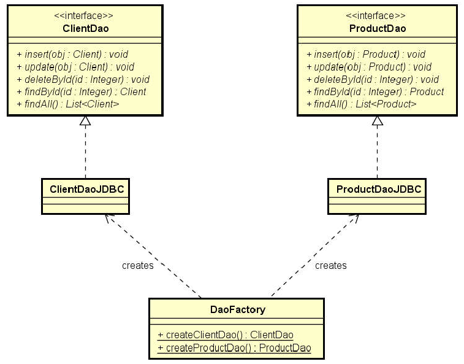

# DATA ACCESS OBJECT

O DAO é um padrão para que um software interaja com um banco de dados, ou outro sistema de persistência, através de uma interface abstrata, escondendo a implementação e as tecnologias usadas para isso (Hibernate, implementação própria etc.).

Em Java e outras linguagens OO, costuma-se definir, para cada entidade, uma interface contendo seus atributos, no estilo <i>EntidadeDAO</i>, além de uma classe auxiliar <i>DAOFactory</i>, que instanciará uma implementação da interface com a tecnologia escolhida.

Por exemplo:

